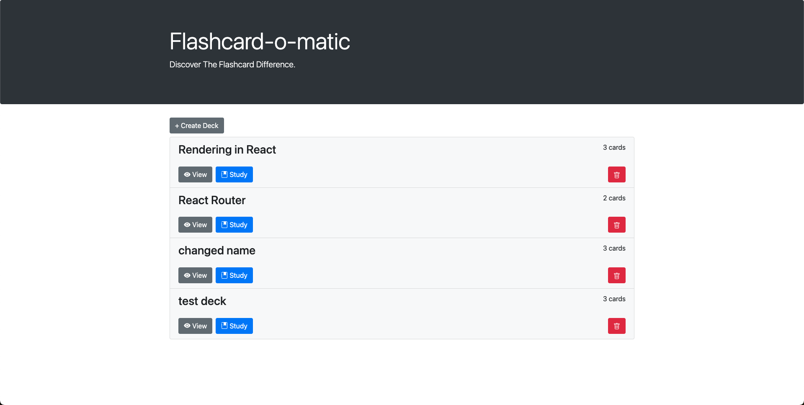

<!-- ABOUT THE PROJECT -->
## About the project

### Homepage Image


### Github link
This is a link the project [GitHub](https://github.com/colinthinkful/Project-_Flashcards-_Qualified-Colin_Harrison-Solution).

### Built With
This section lists major frameworks/libraries used to build the project.

* [![React][React.js]][React-url]
* [![Bootstrap][Bootstrap.com]][Bootstrap-url]

<!-- GETTING STARTED -->
## Getting Started

These are example instructions for setting up the project to run locally.
To get a local copy of this project running, follow these example steps.

<!-- INSTALLATION REQUIREMENTS -->
### Installation

Clone the repository
```sh
git clone https://github.com/colinthinkful/Project-_Flashcards-_Qualified-Colin_Harrison-Solution.git
```

Install NPM packages
```sh
npm install
```

Run the project
```sh
npm run start
```

Test the project
```sh
npm run test
```

<!-- USAGE EXAMPLES -->
## Usage

Use this space to show useful examples of how a project can be used.

* The "Create Deck" button can be used to create a deck of flashcards to study.
    * You can create a deck from the "Home" page.
    * Decks have a name and description and contain a deck of cards to study.
* You can edit a deck from the "View" link for the deck in question.
    * When viewing a deck, you can edit it's information, study the deck, and add or edit cards.
* You can study a deck from the "Home" page or from the "Edit Deck" page.
    * Studying a deck will show the front side of the card. Flipping the card will show the back side and give an option to navigate to the "Next" card.
    * When you have finished studying a deck, you will be given a prompt to either reset the deck or to return to the "Home" page.
* Decks can be deleted from the "Home" page.
